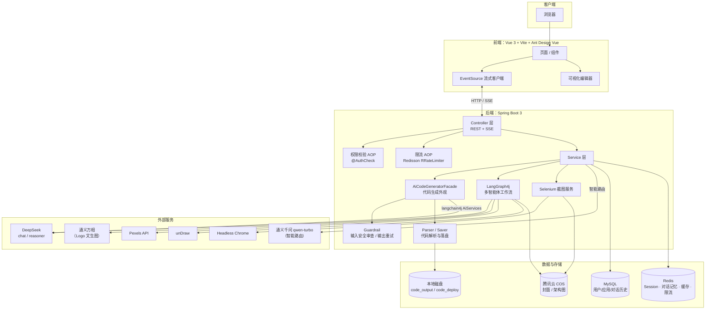
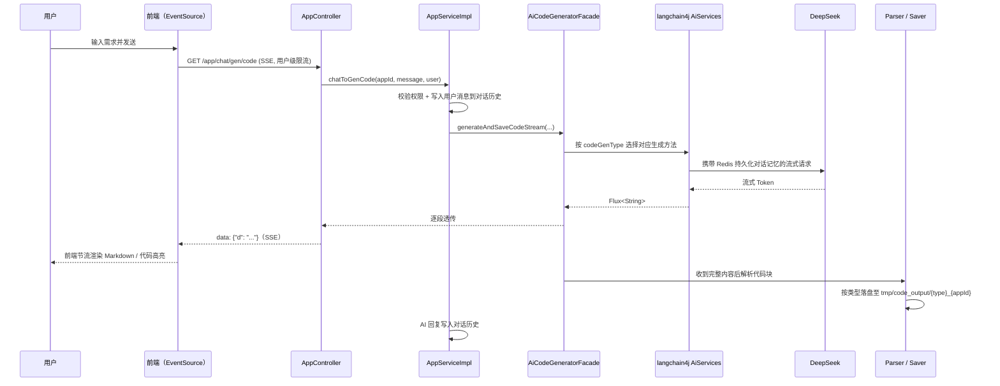
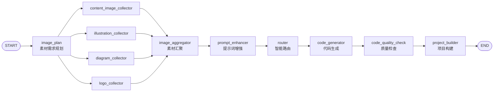

# Josee No Code 网站速搭平台

一个基于 **Spring Boot 3 + Vue 3** 的 AI 原生应用生成平台：用户用自然语言描述需求，AI 通过多轮对话流式生成可直接预览、部署的网页应用（原生 HTML / 多文件 HTML+CSS+JS / Vue 工程三种模式），并内置了素材智能收集、代码质量检查、可视化编辑、一键部署、应用封面截图等配套能力。

后端集成 [LangChain4j](https://github.com/langchain4j/langchain4j) 对接 DeepSeek / 通义千问系列大模型，并用 [LangGraph4j](https://github.com/langgraph4j/langgraph4j) 编排了一套多智能体（Multi-Agent）工作流，用于图片素材的并发收集与代码质量把关。

---

## 目录

- [核心功能](#核心功能)
- [系统架构](#系统架构)
- [核心业务流程](#核心业务流程)
- [LangGraph4j 多智能体工作流模块](#langgraph4j-多智能体工作流模块)
- [技术栈](#技术栈)
- [项目结构](#项目结构)
- [快速开始](#快速开始)
- [主要接口一览](#主要接口一览)
- [安全与稳定性设计](#安全与稳定性设计)

---

## 核心功能

### 🤖 AI 对话式应用生成
- 用户输入一句话需求，AI 自动判定应用类型（`AiCodeGenTypeRoutingService` 智能路由），支持三种代码生成模式：
  - **原生 HTML**：单文件，内联 CSS/JS，适合简单落地页
  - **原生多文件**：HTML / CSS / JS 分离
  - **Vue 工程**：完整 Vue 项目（携带 `@Tool` 文件读写工具，AI 可自主读写/修改/删除项目文件），生成后自动 `npm install && npm run build`
- 基于 SSE（Server-Sent Events）的流式输出，前端边生成边渲染，长文本采用**逐帧节流渲染**（`requestAnimationFrame`）避免 Markdown/代码高亮反复全量重渲染导致页面卡顿
- 每个应用拥有独立的、持久化在 Redis 的多轮对话记忆（`MessageWindowChatMemory` + `RedisChatMemoryStore`），支持基于历史对话连续追问、迭代修改

### 🎨 素材智能收集
- 内置四类素材工具，AI 根据网站主题自主选择调用：
  - `generateLogos`：调用阿里云 DashScope 文生图（万相）生成 Logo
  - `searchContentImages`：调用 Pexels API 搜索内容配图
  - `searchIllustrations`：调用 unDraw 搜索插画素材
  - `generateMermaidDiagram`：调用本地 `mermaid-cli` 把 Mermaid 代码转成架构图并上传腾讯云 COS
- 进阶版工作流（见下文）支持四类素材**并发收集**，大幅缩短等待时间

### 🧪 代码质量检查
- LangGraph4j 工作流中内置质量检查节点，生成结果经 AI 复核后再交付

### 🖱️ 可视化编辑
- 在右侧实时预览的 iframe 中直接点选页面元素，自动把元素的标签/id/class 信息追加到下一次修改指令中，实现"所见即所得"的局部修改体验

### 🚀 一键部署与封面生成
- 应用生成后一键部署，生成独立访问地址（`deployKey`）
- 部署完成后异步用 Selenium 驱动无头 Chrome 对已部署页面截图，自动上传腾讯云 COS 并设为应用封面

### 📦 项目管理与下载
- 我的应用 / 精选应用（管理员置顶，Redis 二级缓存 5 分钟）/ 管理员应用管理（全量增删改查）
- 支持将生成的项目打包为 zip 直接下载（自动过滤 `node_modules`、`.git`、`dist` 等无关目录）

### 💬 对话历史
- 每次生成的用户消息 / AI 回复都会落库，支持按应用维度游标分页加载历史对话，管理员可查看全站对话记录

### 👤 用户与权限
- 账号密码注册登录（Session + Redis 分布式会话），管理员 / 普通用户两级角色（`@AuthCheck` + AOP 拦截实现权限校验）

### 🛡️ 安全防护
- Prompt 注入/越狱检测护轨（`InputGuardrail`）、AI 输出失败自动重试护轨（`OutputGuardrail`）
- 基于 Redisson 分布式限流器的接口级 / 用户级 / IP 级限流（如 AI 对话接口限制每用户每分钟 5 次）

---

## 系统架构



---

## 核心业务流程

### 对话生成代码（主链路）



### 应用部署 + 封面截图

1. `AppServiceImpl#deployApp`：校验权限 → 若为 Vue 工程先执行 `npm install && npm run build` → 生成/复用 `deployKey` → 复制产物到 `tmp/code_deploy/{deployKey}`
2. 拼接部署访问地址（`code.deploy-host` 按 `local` / `prod` Profile 区分配置）
3. 异步虚拟线程调用 `ScreenshotService`：`WebDriverManager` 拉起无头 Chrome 访问部署地址 → 截图 → 压缩 → 上传腾讯云 COS → 回写 `App.cover`

---

## LangGraph4j 多智能体工作流模块

除主链路外，项目还基于 LangGraph4j 实现了一套**独立的、可演示的多智能体工作流**（`CodeGenWorkflow` 顺序版 / `CodeGenConcurrentWorkflow` 并发版，经 `/workflow/**` 接口暴露），用于展示更复杂的 Agent 编排能力：素材需求规划 → 四类素材**并发**收集 → 汇聚 → 提示词增强 → 智能路由 → 代码生成 → 代码质量检查 → 项目构建。



---

## 技术栈

### 后端

| 分类 | 技术 | 说明 |
| --- | --- | --- |
| 基础框架 | Spring Boot 3.5.4 / Java 21 | Web、AOP |
| AI 编排 | LangChain4j 1.1.0 | `AiServices` 动态代理、流式输出、工具调用（Function Calling）、Guardrail |
| 多智能体 | LangGraph4j 1.6.0-rc2 | 图编排工作流（顺序 / 并发） |
| 大模型 | DeepSeek（chat / reasoner）、通义千问 qwen-turbo、通义万相（DashScope SDK） | 分别用于代码生成、推理型生成、智能路由、Logo 文生图 |
| 数据访问 | MyBatis-Flex 1.11.0 | ORM，雪花 ID 主键、逻辑删除、代码生成器 |
| 数据库 | MySQL 8 / HikariCP | 用户、应用、对话历史 |
| 缓存 & 会话 | Redis / Spring Session Data Redis / Spring Cache（Redis 实现） | 分布式 Session、对话记忆、精选应用列表缓存 |
| 限流 | Redisson 3.50.0（`RRateLimiter`） | 接口级 / 用户级 / IP 级分布式限流 |
| 本地缓存 | Caffeine | AI 服务实例缓存（按 appId + 生成类型） |
| 对象存储 | 腾讯云 COS SDK | 应用封面、架构图存储 |
| 浏览器自动化 | Selenium 4 + WebDriverManager 6 | 无头 Chrome 应用截图 |
| 接口文档 | Knife4j（Swagger UI 增强） | `/api/doc.html` |
| 工具库 | Hutool 5 | JSON / HTTP / 文件等通用工具 |

### 前端

| 分类 | 技术 |
| --- | --- |
| 框架 | Vue 3.5（`<script setup>` + Composition API）+ TypeScript |
| 构建工具 | Vite 7 |
| UI 组件库 | Ant Design Vue 4 |
| 状态管理 | Pinia |
| 路由 | Vue Router 4 |
| HTTP | Axios（接口类型由 `@umijs/openapi` 根据后端 OpenAPI 文档自动生成） |
| Markdown 渲染 | markdown-it + highlight.js |
| 实时通信 | 原生 `EventSource`（SSE） |

---

## 项目结构

```
ai-code-mother/
├── src/main/java/com/josee/aicodemother/
│   ├── controller/          # REST / SSE 接口：App、User、ChatHistory、Workflow、静态资源、健康检查
│   ├── service/              # 业务逻辑层
│   ├── ai/                   # 核心 AI 代码生成服务（langchain4j AiServices）、工具、护轨
│   │   ├── tools/             # Vue 工程文件读写工具（FileRead/Write/Modify/Delete、ExitTool）
│   │   └── guardrail/         # 输入安全审查 / 输出重试护轨
│   ├── langgraph4j/           # 多智能体工作流：节点、并发节点、状态、素材收集工具
│   ├── core/                  # 代码生成外观、解析器（Parser）、保存器（Saver）、Vue 项目构建器
│   ├── ratelimiter/            # 限流注解 / AOP 切面 / 限流类型
│   ├── aop/ + annotation/      # 权限校验 AOP（@AuthCheck）
│   ├── config/                 # Redis 缓存、对话记忆、AI 模型、COS、CORS 等配置
│   ├── manager/                # COS 等第三方能力封装
│   ├── model/                  # 实体 / DTO / VO / 枚举
│   ├── mapper/                 # MyBatis-Flex Mapper
│   └── utils/                  # Selenium 截图、Spring 上下文工具等
├── src/main/resources/
│   ├── prompt/                 # 各类系统提示词（HTML / 多文件 / Vue / 路由 / 素材收集 / 质量检查）
│   ├── application.yml         # 基础配置（默认 local Profile）
│   ├── application-local.yml   # 本地开发配置（不提交仓库）
│   └── application-prod.yml    # 生产环境配置（不提交仓库）
├── sql/create_table.sql        # 数据库建表脚本（user / app / chat_history）
├── ai-code-mother-frontend/
│   └── src/
│       ├── pages/               # 主页、登录注册、应用对话页、应用编辑页、管理后台
│       ├── components/          # 通用组件（应用卡片、详情弹窗、页头页脚等）
│       ├── composables/         # 组合式函数（对话历史分页、管理表格、权限判断）
│       ├── api/                 # 由后端 OpenAPI 自动生成的接口调用与类型
│       └── utils/                # Markdown 渲染、可视化编辑、预览地址拼接等
└── pom.xml
```

---

## 快速开始

### 环境要求

- JDK 21+，Maven 3.9+
- Node.js 18+（建议 20+），npm
- MySQL 8
- Redis
- （可选）本机 Chrome/Chromium：应用截图功能需要
- （可选）`mermaid-cli`（`mmdc`）：AI 生成架构图功能需要
- 以下服务的 API Key（均可在对应平台申请）：DeepSeek、阿里云 DashScope（通义千问 / 万相）、Pexels、腾讯云 COS

### 1. 初始化数据库

```bash
mysql -u root -p < sql/create_table.sql
```

### 2. 配置后端

复制并编辑 `src/main/resources/application-local.yml`（该文件已在 `.gitignore` 中，需要自行创建/维护），至少需要填写：数据库密码、各 AI 模型的 `api-key`、腾讯云 COS 密钥、Pexels `api-key`。基础连接信息（端口、数据库地址等）在 `application.yml` 中已有默认值。

### 3. 启动后端

```bash
mvn spring-boot:run
# 或直接运行 AiCodeMotherApplication 主类，默认使用 local Profile
```

默认监听 `http://localhost:8123`，Context Path 为 `/api`；接口文档见 `http://localhost:8123/api/doc.html`。

### 4. 启动前端

```bash
cd ai-code-mother-frontend
npm install
npm run dev
```

默认 `http://localhost:5173`，开发环境下 `/api` 已通过 Vite 代理转发到后端 `8123` 端口。

---

## 主要接口一览

| 模块 | 方法 | 路径 | 说明 |
| --- | --- | --- | --- |
| 用户 | POST | `/api/user/register` `/api/user/login` `/api/user/logout` | 注册 / 登录 / 登出 |
| 用户 | GET | `/api/user/get/login` | 获取当前登录用户 |
| 应用 | GET | `/api/app/chat/gen/code` | **AI 流式生成代码**（SSE，用户级限流） |
| 应用 | POST | `/api/app/deploy` | 部署应用 |
| 应用 | GET | `/api/app/download/{appId}` | 下载项目源码（zip） |
| 应用 | POST | `/api/app/add` `/update` `/delete` | 应用增删改 |
| 应用 | POST | `/api/app/my/list/page/vo` | 我的应用列表 |
| 应用 | POST | `/api/app/good/list/page/vo` | 精选应用列表（缓存 5 分钟） |
| 应用（管理员） | POST/GET | `/api/app/admin/**` | 全量应用管理 |
| 对话历史 | GET | `/api/chatHistory/app/{appId}` | 按应用分页获取对话历史 |
| 静态资源 | GET | `/api/static/{deployKey}/**` | 生成产物 / 实时预览的静态文件服务 |
| 工作流 | POST/GET | `/api/workflow/execute` `/execute-flux` | LangGraph4j 工作流演示接口 |
| 健康检查 | GET | `/api/health/` | 存活探针 |

---

## 安全与稳定性设计

- **权限控制**：`@AuthCheck(mustRole = ...)` + AOP 拦截器，区分普通用户 / 管理员；应用级操作（生成代码、部署）额外校验"仅本人可操作"
- **Prompt 安全护轨**：`PromptSafetyInputGuardrail` 拦截超长输入、敏感词与常见 Prompt 注入/越狱模式（如"忽略之前的指令""ignore previous instructions"等）
- **输出重试护轨**：`RetryOutputGuardrail` 在 AI 输出不符合预期格式时自动重试
- **分布式限流**：基于 Redisson `RRateLimiter`，支持接口级 / 用户级 / IP 级三种粒度，AI 对话接口默认限制每用户每 60 秒 5 次请求
- **多环境隔离**：`application.yml`（默认）/ `application-local.yml`（本地）/ `application-prod.yml`（生产）分离，敏感配置文件均已加入 `.gitignore`，不随仓库提交
